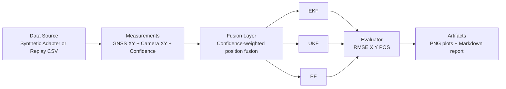

# Sensor Fusion Localization Benchmark

## TL;DR

- Inputs: GNSS-like XY + camera-derived XY (+ confidence) + motion controls.
- Core idea: confidence-aware fusion creates one observation stream for all filters.
- Compared estimators: EKF, UKF, PF.
- Outputs: RMSE metrics, trajectory plots, and optional markdown benchmark report.
- Use cases: quick synthetic checks and replay-based evaluation on converted datasets.

## Research Context

Accurate state estimation from heterogeneous, intermittently available sensors remains a fundamental challenge in mobile robotics and autonomous driving. This benchmark addresses the problem of **confidence-aware sensor fusion for 2D localization** — combining a coarse but always-available GNSS-like measurement with a higher-precision but variable-confidence camera-derived observation. While the robotics literature extensively covers Kalman filtering (EKF, UKF) and particle filtering (PF) individually (Thrun et al., *Probabilistic Robotics*, 2005), direct empirical comparisons under identical fused observation streams are less common, especially with explicit confidence-weighting at the measurement level. This project factors fusion out as a preprocessing layer, enabling a controlled three-way comparison of EKF, UKF, and PF on the same pre-fused sequence. The confidence-weighted fusion scheme relates to adaptive measurement-noise models studied in Bar-Shalom et al. (*Estimation with Applications*, 2001), but is here applied as a lightweight deterministic rule before estimator ingestion, simplifying the architecture while retaining the key benefit of down-weighting degraded visual estimates. By releasing a reproducible pipeline with synthetic and replay-based modes, this project provides a transparent baseline for further research into estimator selection, sensor degradation modelling, and multi-modal fusion under realistic dropout patterns.

<details>
<summary><strong>Project Overview (expanded)</strong></summary>

This project implements a full localization benchmarking pipeline that ingests synchronized control signals and position observations, fuses camera and GNSS-like measurements into a single confidence-aware observation, and evaluates three classical estimators [EKF (Extended Kalman Filter), UKF (Unscented Kalman Filter), and PF (Particle Filter)] under the same frame sequence.

The emphasis is not only algorithm comparison, but reproducible engineering. The workflow includes dataset conversion utilities, deterministic command-line execution, consistent artifact generation, and report-ready outputs. That makes it suitable for method comparison, parameter tuning, and portfolio-style documentation of localization performance.

In short, this module answers a concrete question with repeatable evidence: given the same controls and fused observations, which estimator provides the best trajectory accuracy for a specific scenario and configuration.


## The Project

- Demonstrates confidence-aware sensor fusion in a compact and inspectable pipeline.
- Compares three estimators under identical controls and measurements.
- Supports both synthetic simulation and replay-based evaluation.
- Produces figures and markdown reports suitable for documentation or portfolio use.

## Results Snapshot

Latest replay benchmark on data/tum_fr1_xyz_vo_replay.csv:

| Algorithm | RMSE X (m) | RMSE Y (m) | RMSE POS (m) |
|---|---:|---:|---:|
| EKF | 0.121 | 0.129 | 0.177 |
| UKF | 0.157 | 0.125 | 0.200 |
| PF | 0.393 | 0.131 | 0.414 |

Lower values are better. In this run, EKF achieved the best position RMSE.

## Pipeline Overview

At each frame, the system:

1. Reads controls and ground-truth context from a data adapter.
2. Reads two position observations (GNSS-like and camera XY).
3. Fuses observations using confidence-weighted uncertainty logic.
4. Updates EKF, UKF, and PF using the same fused measurement.
5. Logs trajectories and computes RMSE metrics.
6. Exports benchmark plots and optional markdown report.



## Project Layout

- run_sensor_fusion_benchmark.py: main benchmark entrypoint
- models.py: shared dataclasses for frame/control/metrics
- fusion.py: confidence-aware GNSS + camera fusion
- evaluator.py: RMSE computation
- adapters/synthetic_route_adapter.py: synthetic route source
- adapters/replay_dataset_adapter.py: CSV replay source
- perception/landmark_camera_localizer.py: synthetic camera localizer path
- tools/convert_tum_to_replay_csv.py: ground-truth-only TUM conversion
- tools/convert_tum_sequence_to_replay_csv.py: full TUM sequence conversion with optional RGB-D VO camera XY
- visualize_gt_vo_fused.py: GT/VO/fused overlay generation
- sample_replay_schema.csv: minimal schema example
- output/: generated figures and reports
- data/: local replay CSVs and dataset extracts

## Prerequisites

- Python 3.10+
- Install repository dependencies from repo root:

```bash
pip install -r requirements.txt
```

- For VO-based TUM conversion (camera-source vo), OpenCV is required:

```bash
pip install opencv-python
```

## Quickstart

Run these commands from repository root.

### 1) Convert TUM sequence to replay CSV (VO camera measurements)

```bash
python src/projects/sensor_fusion_localization/tools/convert_tum_sequence_to_replay_csv.py \
  --sequence-dir src/projects/sensor_fusion_localization/data/rgbd_dataset_freiburg1_xyz \
  --output src/projects/sensor_fusion_localization/data/tum_fr1_xyz_vo_replay.csv \
  --camera-source vo
```

### 2) Run replay benchmark and export report

```bash
python src/projects/sensor_fusion_localization/run_sensor_fusion_benchmark.py \
  --source replay \
  --dataset src/projects/sensor_fusion_localization/data/tum_fr1_xyz_vo_replay.csv \
  --report
```

### 3) Generate trajectory overlays

```bash
python src/projects/sensor_fusion_localization/visualize_gt_vo_fused.py \
  --dataset src/projects/sensor_fusion_localization/data/tum_fr1_xyz_vo_replay.csv \
  --smooth-window 31
```

## Common Commands

```bash
# Synthetic benchmark
python src/projects/sensor_fusion_localization/run_sensor_fusion_benchmark.py \
  --source synthetic --total-time 36 --dt 0.1

# Replay benchmark
python src/projects/sensor_fusion_localization/run_sensor_fusion_benchmark.py \
  --source replay --dataset <replay.csv> --report

# Particle filter tuning example
python src/projects/sensor_fusion_localization/run_sensor_fusion_benchmark.py \
  --source replay --dataset <replay.csv> \
  --pf-particles 800 --pf-resampling low_variance --pf-resample-threshold 0.45 --report

# Ground-truth-only TUM conversion
python src/projects/sensor_fusion_localization/tools/convert_tum_to_replay_csv.py \
  --input <groundtruth.txt> --output <replay.csv>

# Full extracted TUM sequence conversion with VO camera_x/y
python src/projects/sensor_fusion_localization/tools/convert_tum_sequence_to_replay_csv.py \
  --sequence-dir <tum_sequence_dir> --output <replay.csv> --camera-source vo
```

## Replay CSV Contract

Expected columns:

timestamp_s,dt_s,accel_mps2,yaw_rate_rps,gt_x_m,gt_y_m,gt_yaw_rad,gt_speed_mps,gnss_x_m,gnss_y_m,camera_x_m,camera_y_m,camera_confidence

Use NaN for missing GNSS or camera observations.

Field guide:

| Column | Description |
|---|---|
| timestamp_s | Frame timestamp in seconds |
| dt_s | Time delta from previous frame |
| accel_mps2 | Longitudinal acceleration control |
| yaw_rate_rps | Yaw-rate control |
| gt_x_m, gt_y_m | Ground-truth position |
| gt_yaw_rad | Ground-truth yaw |
| gt_speed_mps | Ground-truth speed |
| gnss_x_m, gnss_y_m | GNSS-like observation |
| camera_x_m, camera_y_m | Camera-derived observation |
| camera_confidence | Camera confidence in [0, 1] |

## TUM Sequence Notes

When using convert_tum_sequence_to_replay_csv.py:

- sequence-dir must contain at minimum groundtruth.txt and rgb.txt.
- camera-source vo computes camera XY from RGB-D visual odometry.
- camera-source synthetic injects synthetic camera noise around ground truth.
- GNSS columns are generated as GNSS-like noisy observations for benchmarking.

Useful options:

- --max-gt-dt: max timestamp association gap between RGB and ground truth
- --min-pnp-points: minimum valid RGB-D correspondences for PnP
- --max-depth-m: max depth used for RGB-D backprojection

## Output Artifacts

Benchmark outputs:

- output/sensor_fusion_localization_benchmark.png
- output/sensor_fusion_localization_report.md (when --report is enabled)

Overlay outputs:

- output/gt_vo_fused_overlay.png
- output/gt_vo_fused_overlay_portfolio.png

## Interpreting Metrics

- RMSE X and RMSE Y indicate axis-wise error.
- RMSE POS is the primary overall localization indicator.
- A large X vs Y gap can indicate directional observability imbalance.
- PF may require particle count and resampling tuning for stable replay performance.

## Current Scope and Limitations

- VO path is intentionally lightweight (ORB matching + RGB-D PnP + trajectory accumulation).
- TUM replay GNSS is GNSS-like simulated noise, not true vehicle GNSS logs.
- Benchmark is 2D-focused and intended for controlled comparison, not production navigation.

## Suggested Next Steps

1. Integrate true GNSS/INS logs (for example, KITTI or Oxford RobotCar).
2. Add VO outlier rejection and loop-closure constraints.
3. Export innovation and covariance diagnostics for filter analysis.
4. Add automated hyperparameter sweeps for PF and sensor-noise settings.

## Related Documentation

- Dataset shortlist and licensing notes: [DATASET_SOURCES.md](DATASET_SOURCES.md)

</details>
