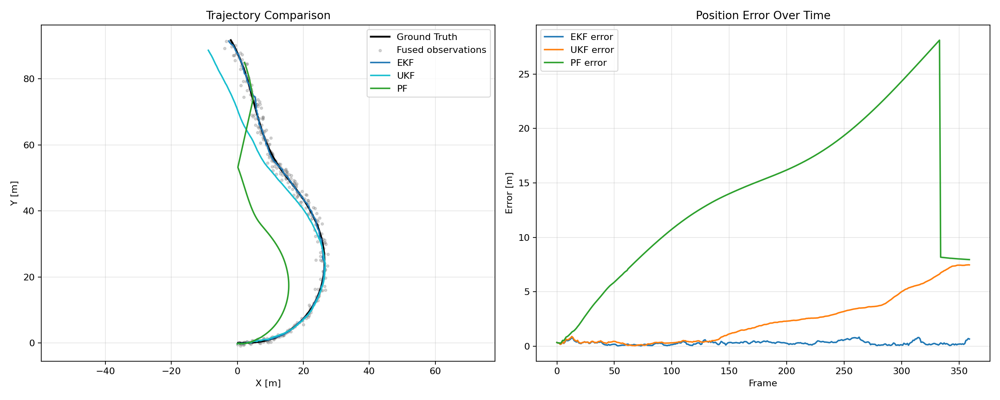

# Sensor-Fusion Localization Benchmark Report

- Generated: 2026-07-01 19:00:11 UTC
- Source mode: replay
- Dataset: src/projects/sensor_fusion_localization/data/tum_fr1_xyz_vo_replay.csv
- Synthetic duration: 36.0s
- Synthetic dt: 0.1s
- PF particles: 500
- PF resampling: systematic
- PF threshold: 0.5

## Metrics

| Algorithm | RMSE X (m) | RMSE Y (m) | RMSE POS (m) |
|---|---:|---:|---:|
| EKF | 0.121 | 0.129 | 0.177 |
| UKF | 0.157 | 0.125 | 0.200 |
| PF | 0.393 | 0.131 | 0.414 |

## Figure

